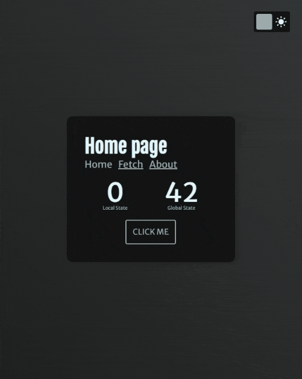

# React Proto - React TypeScript Boilerplate

      


**Template React project with full TypeScript and SSR support.**

This project is a compilation of different approaches in React development that allows not only to start a new project quickly, but to learn how it works under the hood.

You can also check a [React Proto Lite](https://github.com/StopNGo/react-proto-lite) - Template React project for fast SPA prototyping. It contains only everything necessary for Single Page Application projects without any server side parts.

## Huge Update: Migrating to Rspack

Starting from version `2.0.0`, this project uses [Rspack](https://rspack.dev/) as the primary bundler.

Rspack is a high performance JavaScript bundler written in Rust. It offers strong compatibility with the webpack ecosystem, allowing for seamless replacement of webpack, and provides lightning fast build speeds.

Webpack is still available as an option ([rspack vs webpack](#rspack-vs-webpack) and [switching back to webpack](#switching-back-to-webpack)).

---
- [Issue](#issue)
- [What's Inside](#whats-inside)
- [The App](#the-app)
- [How to Use](#how-to-use)
- [Basic Project Configuration](#basic-project-Configuration)
- [General Notices](#general-notices)
- [Documentation](#documentation)
- [Changes](#changes)
- [Feedback](#feedback)
---

## Issue

Every new React developer knows that React is a library, not a complete framework. Thus, it provides maximum flexibility. However, a lot of knowledge is required to create a fully functional web application powered with React.

That is why there exist such a famous framework as [Next.js](https://nextjs.org/) as well as a tool [Create React App (CRA)](https://create-react-app.dev/) or [Rsbuild for React](https://rsbuild.dev/guide/framework/react).

Despite the advantages that such tools have, there are some cons that their user may face:

- Lack of understanding how exactly certain solutions work and why they are applied;
- Lack of flexibility: applied solutions are difficult to fine-tune to your needs;
- The complexity of the codebase of these tools.

As a result, novice React developers have two options for action:

1. Simply apply these tools and frameworks to get the product without going into the nuances of their implementation;
2. Independently collect bit by bit information on how to implement certain functions in React ecosystem.

Thus, the goal of this project is to **collect in one place all the most common methods of working with the React ecosystem** without being tied to a specific framework or tool like CRA.

## What's Inside

Core:

- **React** 18+ (**Preact** 10+ as an option, see [comparison](#react-vs-preact) below)
- **Rspack** 1 (**webpack** 5+ as an option) with **SWC** support and SSR or static build ([why not Vite?](#why-not-vite), [rspack vs webpack](#rspack-vs-webpack) and [switching back to webpack](#switching-back-to-webpack))
- **TypeScript** (with strict rules, including webpack configuration)

SSR:

- **Express** (with render to stream option including helmet data and initial state pushing)

State:

- **Redux** 5 (with custom state persisting middleware; [why not redux-persist package?](#why-not-redux-persist-package))

Router:

- **React Router**

Code Splitting:

- **Loadable Components** (SSR compatible)

API:

- **RTK Query**

i18n (Internationalization):

- **Lightweight custom solution** based on Redux (with async loading and SSR support; [why not any common i18n package?](#why-not-any-common-i18n-package))

Styles:

- **(S)CSS modules** (with TypeScript support)

Linters:

- **TS Standard** (TypeScript Style Guide, with linter and automatic code fixer based on [StandardJS](https://standardjs.com/))
- **Stylelint** (including rules order)
- **Prettier**

Tests:

- **Jest** 29+
- **React Testing Library**
- Utility for Redux Testing
- One example of integration test of a component with user event and Redux

Other:

- API request caching (powered by RTK Query)
- Data prefetching on server side
- State persisting to Local Storage
- Hot reload (including state, style and server code hot reloading)
- HOC for preventing component rendering on the server
- VSCode support with error highlight and on save fixes
- Script for fast component creation
- Optional Service worker and offline status detector
- Webpack Bundle Analyzer

## The App

This boilerplate includes a simple application with:

- Several screen/pages with their own routes
- Local counter
- Global counter
- One of the components is dynamically loaded
- API requests
- Loading spinner
- Theme switcher (light and dark)
- Offline detector

Live preview:
[https://react-proto.onrender.com/](https://react-proto.onrender.com/)

(due to free hosting, a cold start could be slow)



## How to Use

### Quick Start (SSR with hot reload)

1. Clone this repo:

   `git clone https://github.com/StopNGo/react-proto`

2. Delete the `_webpack` folder if you are not going to use webpack bundler or [switch to it](#switching-back-to-webpack) before installing the packages.

3. Install all packages:

   `npm i`

4. Run project in a development mode:

   `npm start`

5. Open your browser with the next address:

   `http://localhost:8080/`

### Build and run a server (SSR)

1. Build the project (production bundle will be in the `"dist"` folder):

   `npm run build`

   or with Webpack Bundle Analyzer report server:

   `npm run build:report`

2. Run a server:

   `npm run run`

3. You can test the server locally:

   `http://localhost:3000/`

### Static development mode with hot reload

- Just run the next command and browser will open automatically:

  `npm run start:static`

### Static production

- Run the next command and get a production bundle in the `"dist"` folder:

  `npm run build:static`

  or with Webpack Bundle Analyzer report server:

  `npm run build:static:report`

### Switching back to webpack

- Copy the contents of `_webpack` folder (except `README.md`) to the root of the project.

- Delete the `rspack.config.ts` file.

- Delete the `rspack` and `_webpack` folders.

- If you have a previous installation, clean the `node_modules` folder.

- Then install the packages:

   `npm i`

### Updating packages

All packages in this project are pinned to latest versions at the time of publishing to exclude version-based conflicts and errors and to guarantee proper work of the code in this repository.

If you want to update packages, do next:

```
npm install -g npm-check-updates
ncu -u
npm i
```

## Basic Project Configuration

All configuration is available in files with constants:

- `webpack\constants.ts` - contains working directories, SWC option and other related to bundling staff
- `src\constants` - a directory with app files with configuration constants
- `src\server\constants.ts` - contains a server port and render to stream options

## General Notices
### Why not Vite

Vite is an excellent new generation bundler that could speed up your development process. However, you can face with some lack of flexibility and compatibility especially in big projects that need a lot of specific configurations. Also, webpack has many good plugins that are not compatible with Vite.

As for the speed: you can check this article - [Storybook Performance: Vite vs Webpack](https://storybook.js.org/blog/storybook-performance-from-webpack-to-vite/). As you can see - Webpack could still be fast enough. React Proto has such configurations. In `webpack\constants.ts` you can switch on SWC and Lazy Compilation.

Starting from version `2.0.0`, this project uses [Rspack](https://rspack.dev/) as the primary bundler. This bundler written in Rust and offers strong compatibility with the webpack ecosystem, so, performance should be much better ([rspack vs webpack](#rspack-vs-webpack)).

I'm also looking forward to [Turbopack](https://turbo.build/pack) — another Rust-powered successor to Webpack. Currently, it's available only in Next.js, but it might be released as a standalone CLI tool in the future.

### Rspack vs webpack

Rspack is a high performance JavaScript bundler written in Rust. It offers strong compatibility with the webpack ecosystem, allowing for seamless replacement of webpack, and provides lightning fast build speeds.

Here is a comparison between Rspack 1 with the built-in SWC loader and Webpack 5+ with the external SWC loader, while building the SSR version of the sample application on the same hardware configuration:

|         | Rspack     | webpack   |
| ------- | --------- | -------- |
| Server  | 5.35 s | 6.83 s |
| Client | 5.32 s  | 7.50 s |

Of course, the larger the project, the greater the performance advantage. However, if you need more webpack compatibility or hot module reloading while developing with [Preact](#react-vs-preact), you can always [switch back to the webpack bundler](#switching-back-to-webpack).

Also, the optimization process of Rspack is currently slightly worse. Check the bundle size comparison for the non-SSR version of the sample application in this repository:

|         | Rspack     | webpack   |
| ------- | --------- | -------- |
| Parsed  | 284.47 KB | 262.9 KB |
| Gzipped | 90.29 KB  | 86.84 KB |
### React vs Preact

In `webpack\constants.ts` you can choose to use [Preact](https://preactjs.com/) library instead React itself (`IS_PREACT` boolean constant).

Preact is a fast and compact React-compatible Virtual DOM library. But because its community is much smaller, you can face with some incompatibility with React API and functionality, especially with new ones. Also some tests show some frame drops during moving a lot of elements. Below you can see a bundle size comparison of no-SSR version of the sample application of this repository that was built with Rspack (according to Webpack Bundle Analyzer):

|         | React     | Preact   |
| ------- | --------- | -------- |
| Parsed  | 262.9 KB | 150.55 KB |
| Gzipped | 86.84 KB  | 52.09 KB |

**Important Note**
At the moment, the Rspack version of the project does not support hot module reloading during development with Preact. Compared to Webpack, it requires some additional tricky configuration, which I will probably add in the near future. However, if you need HMR (and you definitely do!), you can develop your project using React and then build it with Preact. Or just [switch your project back to the webpack](#switching-back-to-webpack).

### Why not any common i18n package?
You can freely integrate any React compatible i18n solution. But if React Proto already uses Redux and RTK, why just not use them for this task? Therefore, I have created a custom internationalization solution with a minimum additional code. It supports translations dynamic loading, server side rendering based on user acceptable languages, strict typing, etc. At the moment it just does not support string processing like pluralization, but it could easily be added later.

### Why not redux-persist package?
As for me this solution is overcomplicated in most of cases. It definitely has a lot of "storage engines", state version control and etc., but smart using of Redux Middlewares and Listeners can cover all this functionality in a more precise way.
## Documentation

_Coming soon._

One of the goals of this project is to provide some common solutions in React development and to clarify why they were chosen and how they work. So, such information will be present in this documentation in an orderly fashion.

## Changes

Detailed release notes for a given version can be found on [releases page](https://github.com/StopNGo/react-proto/releases).

## Feedback

I welcome any feedbacks, suggestions and questions related to this project.

You can leave them on [issues](https://github.com/StopNGo/react-proto/issues) or [discussions](https://github.com/StopNGo/react-proto/discussions) pages.


**Thank you!**
